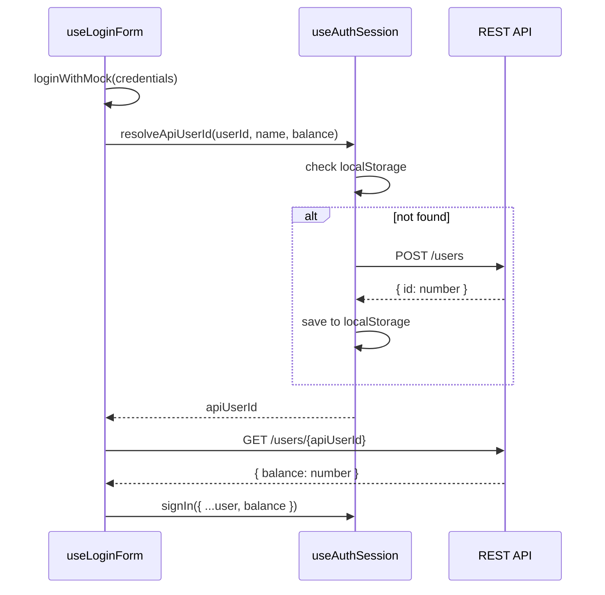
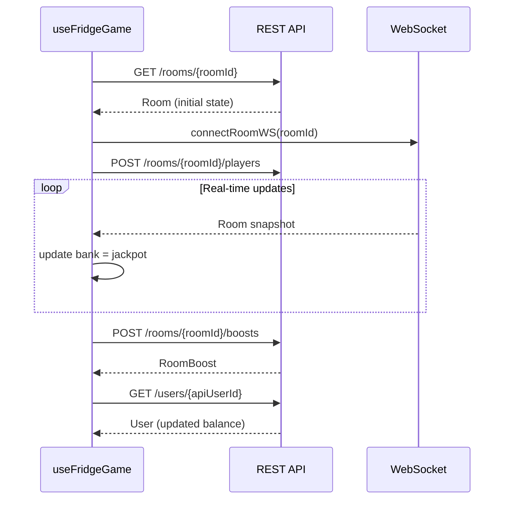

# Design Document: Frontend API Integration

## Overview

Фича подключает фронтенд игровой платформы "Ночной жор" к реальному REST API и WebSocket бэкенду, заменяя моки и статичные данные живыми данными. Работа охватывает 7 областей: вынос общей логики `resolveApiUserId`, авторизация через API, последние игры на главной, кнопка "Быстрая игра", детали раундов в журнале, сохранение шаблонов и подключение Fridge Game к API.

Стек: React 18 + TypeScript, FSD-архитектура, TanStack Query v5, Go REST API (`http://localhost:8888/api/v1`) + WebSocket.

Все API-функции уже реализованы в `shared/api/`. Все TypeScript-типы уже определены в `shared/types/`. Задача — подключить существующие хуки и компоненты к этим функциям.

---

## Architecture

### Слои FSD и направление зависимостей

```
app
 └── pages (auth, home, lobby, create-game, fridge-game)
      └── widgets (header)
           └── features
                └── entities (user)
                     └── shared (api, types, ui, lib)
processes (auth-session) — горизонтальный слой, используется pages
```

Ключевое изменение архитектуры: функция `resolveApiUserId` выносится из `use-lobby.ts` и `use-join-game.ts` в `processes/auth-session/model/use-auth-session.ts` как экспортируемая утилита. Это устраняет дублирование кода и создаёт единую точку управления идентификацией API-пользователя.

### Поток данных авторизации



### Поток данных Fridge Game



---

## Components and Interfaces

### 1. `processes/auth-session/model/use-auth-session.ts`

Добавляется экспортируемая функция `resolveApiUserId`. Хук `useAuthSession` остаётся без изменений.

```typescript
// Новый экспорт
export async function resolveApiUserId(
  userId: string,
  userName: string,
  userBalance: number,
): Promise<number>
```

Логика (идентична текущей в `use-lobby.ts`):
1. Если `userId` — положительное целое число → вернуть его
2. Проверить `localStorage` по ключу `kubok26.api-user-id:{userId}`
3. Вызвать `POST /users` и сохранить результат в `localStorage`

`use-lobby.ts` и `use-join-game.ts` заменяют свои локальные реализации на импорт из `processes/auth-session`.

---

### 2. `pages/auth/lib/use-login-form.ts`

Хук расширяется: после `loginWithMock` вызывается `resolveApiUserId`, затем `GET /users/{apiUserId}` для актуального баланса.

```typescript
// Новые зависимости
import { resolveApiUserId } from '@processes/auth-session'
import { getUser } from '@shared/api'

// Новое состояние
const [isApiLoading, setIsApiLoading] = useState(false)

// Изменённый onSubmit
async function onSubmit(values: LoginFormValues): Promise<void> {
  const authUser = loginWithMock(...)
  if (!authUser) { /* setError */ return }

  setIsApiLoading(true)
  try {
    const apiUserId = await resolveApiUserId(authUser.id, authUser.name, authUser.balance)
    const apiUser = await getUser(apiUserId)
    onSuccess({ ...authUser, balance: apiUser.balance })
  } catch {
    form.setError('root', { message: 'Ошибка подключения к серверу. Попробуйте снова.' })
  } finally {
    setIsApiLoading(false)
  }
}

// Возвращает дополнительно
return { ..., isApiLoading }
```

---

### 3. `pages/home/lib/use-last-games.ts` (новый файл)

```typescript
export function useLastGames() {
  const query = useQuery({
    queryKey: ['rounds'],
    queryFn: listRounds,
  })

  const lastFive = useMemo(() => {
    if (!query.data?.rounds) return []
    return [...query.data.rounds]
      .sort((a, b) => new Date(b.start_time).getTime() - new Date(a.start_time).getTime())
      .slice(0, 5)
  }, [query.data])

  return {
    rounds: lastFive,
    isLoading: query.isLoading,
    isError: query.isError,
  }
}
```

`LastGamesSection` заменяет статичный `lastGames` на данные из `useLastGames()`.

---

### 4. `pages/home/lib/use-quick-game.ts` (новый файл)

```typescript
type UseQuickGameOptions = {
  userId: string
  userName: string
  userBalance: number
  onJoinLobby: (roomId: number) => void
}

export function useQuickGame({ userId, userName, userBalance, onJoinLobby }: UseQuickGameOptions) {
  const [isLoading, setIsLoading] = useState(false)
  const [error, setError] = useState('')

  async function handleQuickGame(): Promise<void> {
    setIsLoading(true)
    setError('')
    try {
      const { rooms } = await listRooms({ status: 'new' })
      if (rooms.length === 0) {
        setError('Нет доступных комнат')
        return
      }
      const apiUserId = await resolveApiUserId(userId, userName, userBalance)
      for (const room of rooms) {
        try {
          await joinRoom(room.room_id, { user_id: apiUserId, places: 1 })
          onJoinLobby(room.room_id)
          return
        } catch (err) {
          if (err instanceof ApiClientError && err.status === 409) {
            const detail = (err.details as { detail?: string }).detail
            if (detail === 'room is full') continue // fallback to next
          }
          throw err // 402 и другие ошибки — пробросить
        }
      }
      setError('Нет доступных комнат')
    } catch (err) {
      setError(mapQuickGameError(err))
    } finally {
      setIsLoading(false)
    }
  }

  return { handleQuickGame, isLoading, error }
}
```

`HomePage` получает `user` и `onJoinLobby` пропсы (уже есть `onJoinGame`), кнопка "Быстрая игра" подключается к `handleQuickGame`.

---

### 5. `pages/lobby/ui/journal-modal.tsx`

Добавляется `expandedRoundId` state и `useQuery` для деталей раунда.

```typescript
// Новое состояние
const [expandedRoundId, setExpandedRoundId] = useState<number | null>(null)

// Новый запрос (внутри компонента или вынесен в sub-компонент)
const detailsQuery = useQuery({
  queryKey: ['round-details', expandedRoundId],
  queryFn: () => getRoundDetails(expandedRoundId!),
  enabled: expandedRoundId !== null,
})
```

При клике на карточку раунда — `setExpandedRoundId(round.room_id)`. Повторный клик — сворачивает. TanStack Query кэширует результат по ключу `['round-details', roomId]`.

Отображаемые данные из `RoundDetails`:
- Игроки: `user_id`, `places`, `joined_at`
- Бусты: `user_id`, `amount`, `boosted_at`

---

### 6. `pages/create-game/lib/use-create-game.ts` + `pages/create-game/ui/configurator-modal.tsx`

**Изменения в `use-create-game.ts`:**

```typescript
// Новое состояние
const [templateName, setTemplateName] = useState('')
const [templateSaveSuccess, setTemplateSaveSuccess] = useState(false)

// Новая мутация
const saveTemplateMutation = useMutation({
  mutationFn: () => createRoomTemplate({
    name: templateName,
    players_needed: configDraft.seatsTotal,
    entry_cost: configDraft.entryCost,
    winner_pct: configDraft.prizeFundPercent,
    game_type: mapBackgroundToGameType(background),
  }),
  onSuccess: () => {
    setTemplateSaveSuccess(true)
    queryClient.invalidateQueries({ queryKey: ['room-templates'] })
  },
})

// Применение шаблона
function applyTemplate(template: RoomTemplate): void {
  setConfigDraft(prev => ({
    ...prev,
    seatsTotal: template.players_needed,
    entryCost: template.entry_cost,
    prizeFundPercent: template.winner_pct,
  }))
  setPlayersCount(String(template.players_needed))
  setStartPrice(String(template.entry_cost))
}
```

**Изменения в `configurator-modal.tsx`:**
- Поле ввода имени шаблона (`templateName`)
- Кнопка "Сохранить как шаблон" (disabled при `!analysis.canSave || !templateName`)
- Список шаблонов из `templatesQuery.data` с кнопкой применения каждого
- Error/success состояния для сохранения шаблона

**Новая функция в `shared/api/templates.ts`:**

```typescript
export function createRoomTemplate(body: CreateTemplateBody): Promise<RoomTemplate> {
  return apiRequest<RoomTemplate>({
    method: 'POST',
    url: '/room-templates',
    data: body,
  })
}
```

---

### 7. `pages/fridge-game/lib/use-fridge-game.ts`

Хук переписывается для приёма `roomId` и `user` пропсов и подключения к API.

```typescript
type UseFridgeGameOptions = {
  roomId: number
  userId: string
  userName: string
  userBalance: number
  onUserBalanceChange: (balance: number) => void
}

export function useFridgeGame({
  roomId, userId, userName, userBalance, onUserBalanceChange
}: UseFridgeGameOptions) {
  // GET /rooms/{roomId}
  const roomQuery = useQuery({
    queryKey: ['room', roomId],
    queryFn: () => getRoom(roomId),
  })

  // WebSocket real-time updates
  const [liveRoom, setLiveRoom] = useState<Room | null>(null)
  useEffect(() => {
    return connectRoomWS(roomId, (snapshot) => setLiveRoom(snapshot))
  }, [roomId])

  const room = liveRoom ?? roomQuery.data ?? null
  const bank = room?.jackpot ?? INITIAL_BANK

  // JOIN при монтировании
  const [joinError, setJoinError] = useState('')
  useEffect(() => {
    let cancelled = false
    resolveApiUserId(userId, userName, userBalance)
      .then(apiUserId => joinRoom(roomId, { user_id: apiUserId, places: 1 }))
      .catch(err => {
        if (!cancelled) setJoinError(mapJoinError(err))
      })
    return () => { cancelled = true }
  }, [roomId])

  // buyRoomBoost вместо локального handleAddBonus
  const [hasBoosted, setHasBoosted] = useState(false)
  const buyBoostMutation = useMutation({
    mutationFn: async () => {
      const apiUserId = await resolveApiUserId(userId, userName, userBalance)
      return buyRoomBoost(roomId, { user_id: apiUserId, amount: Number(bonusInput) })
    },
    onSuccess: async () => {
      setHasBoosted(true)
      setGameState('bonus_added')
      const apiUserId = await resolveApiUserId(userId, userName, userBalance)
      const apiUser = await getUser(apiUserId)
      onUserBalanceChange(apiUser.balance)
    },
    onError: (err) => {
      if (err instanceof ApiClientError && err.status === 409) setHasBoosted(true)
    },
  })

  // winChance — локальная формула на основе данных комнаты
  // (calcRoomBoostProbability доступен, но требует apiUserId — используем как в лобби)
  const winChance = room
    ? Math.round(100 / Math.max(1, room.players_needed))
    : INITIAL_WIN_CHANCE

  // ... остальной state (gameState, selectedCell, timeLeft) без изменений
}
```

`FridgeGamePage` получает `roomId`, `userId`, `userName`, `userBalance`, `onUserBalanceChange` через пропсы (передаются из роутера/App).

---

## Data Models

Все типы уже определены в `shared/types/`. Ниже — ключевые типы, задействованные в этой фиче.

### Используемые типы

```typescript
// shared/types/user.ts
type User = { id: number; name: string; balance: number; created_at: string }

// shared/types/room.ts
type Room = {
  room_id: number; jackpot: number; status: RoomStatus;
  players_needed: number; entry_cost: number; game_type: GameType; ...
}

// shared/types/round.ts
type Round = {
  room_id: number; jackpot: number; entry_cost: number;
  start_time: string; players: RoundPlayer[]; boosts: RoundBoost[]; winner: RoundWinner
}
type RoundDetails = {
  room_id: number; players: RoundPlayerDetailed[]; boosts: RoundBoostDetailed[]; ...
}
type RoundPlayerDetailed = { user_id: number; places: number; joined_at: string }
type RoundBoostDetailed  = { user_id: number; amount: number; boosted_at: string }

// shared/types/template.ts
type RoomTemplate = {
  template_id: number; name: string; players_needed: number;
  entry_cost: number; winner_pct: number; game_type: GameType; ...
}
type CreateTemplateBody = {
  name: string; players_needed: number; entry_cost: number;
  winner_pct?: number; game_type?: GameType; ...
}
```

### localStorage-ключи

| Ключ | Значение | Используется в |
|---|---|---|
| `kubok26.mock-auth.user` | JSON `AuthUser` | `entities/user/model/auth.ts` |
| `kubok26.api-user-id:{userId}` | числовой `apiUserId` | `processes/auth-session` |

### TanStack Query — ключи кэша

| Query Key | Эндпоинт | Используется в |
|---|---|---|
| `['rounds']` | `GET /rounds` | `use-last-games`, `use-lobby` |
| `['room', roomId]` | `GET /rooms/{roomId}` | `use-lobby`, `use-fridge-game` |
| `['round-details', roomId]` | `GET /rounds/{roomId}/details` | `journal-modal` |
| `['room-templates', 'create-game']` | `GET /room-templates` | `use-create-game` |
| `['room-templates']` | `GET /room-templates` | инвалидация после `POST /room-templates` |
| `['room-players', roomId]` | `GET /rooms/{roomId}/players` | `use-lobby` |
| `['room-boosts', roomId]` | `GET /rooms/{roomId}/boosts` | `use-lobby` |

---

## Correctness Properties

*A property is a characteristic or behavior that should hold true across all valid executions of a system — essentially, a formal statement about what the system should do. Properties serve as the bridge between human-readable specifications and machine-verifiable correctness guarantees.*

### Property 1: resolveApiUserId идемпотентность

*For any* строкового `userId`, если `resolveApiUserId` уже был вызван и сохранил `apiUserId` в `localStorage`, то повторный вызов с тем же `userId` должен вернуть тот же числовой `apiUserId` без обращения к `POST /users`.

**Validates: Requirements 1.2**

---

### Property 2: Баланс из API корректно отражается в состоянии

*For any* числового значения `balance`, возвращённого `GET /users/{apiUserId}`, состояние `AuthUser.balance` после завершения логина должно равняться этому значению.

**Validates: Requirements 2.4**

---

### Property 3: localStorage-ключ соответствует шаблону

*For any* строкового `mockUserId`, после успешного `POST /users`, значение в `localStorage` по ключу `kubok26.api-user-id:{mockUserId}` должно совпадать с числовым `id` из ответа API.

**Validates: Requirements 2.2**

---

### Property 4: Последние игры — топ-5 по убыванию start_time

*For any* массива объектов `Round` произвольного размера, функция выборки последних игр должна возвращать не более 5 элементов, отсортированных по убыванию `start_time`.

**Validates: Requirements 3.2**

---

### Property 5: Карточка раунда содержит все обязательные поля

*For any* объекта `Round`, функция рендеринга карточки должна включать в вывод `room_id`, `jackpot`, `entry_cost` и дату из `start_time`.

**Validates: Requirements 3.3**

---

### Property 6: Fallback на следующую комнату при 409 "room is full"

*For any* списка комнат, где первые N комнат возвращают `409 room is full`, алгоритм быстрой игры должен выбрать первую комнату, не вернувшую `409`, и вернуть её `room_id`.

**Validates: Requirements 4.6**

---

### Property 7: Детали раунда содержат все поля игроков и бустов

*For any* объекта `RoundDetails`, рендер деталей раунда должен содержать для каждого игрока `user_id`, `places`, `joined_at`, а для каждого буста — `user_id`, `amount`, `boosted_at`.

**Validates: Requirements 5.2, 5.3**

---

### Property 8: Кэширование деталей раунда

*For any* `roomId`, после первого успешного запроса `GET /rounds/{roomId}/details`, повторный клик на тот же раунд не должен инициировать новый сетевой запрос (данные берутся из кэша TanStack Query).

**Validates: Requirements 5.6**

---

### Property 9: Применение шаблона заполняет поля конфигуратора

*For any* объекта `RoomTemplate`, после вызова `applyTemplate(template)`, состояние `configDraft` должно содержать `seatsTotal === template.players_needed`, `entryCost === template.entry_cost`, `prizeFundPercent === template.winner_pct`.

**Validates: Requirements 6.8**

---

### Property 10: WebSocket snapshot обновляет bank

*For any* объекта `Room` (snapshot), полученного через WebSocket, значение `bank` в состоянии `useFridgeGame` должно равняться `snapshot.jackpot`.

**Validates: Requirements 7.3**

---

## Error Handling

### Стратегия обработки ошибок

Все ошибки API типизированы через `ApiClientError` из `shared/api/client`. Каждый хук отвечает за маппинг ошибок в пользовательские сообщения.

### Матрица ошибок по компонентам

| Компонент | HTTP статус | Сообщение пользователю |
|---|---|---|
| `use-login-form` | сетевая ошибка | "Ошибка подключения к серверу. Попробуйте снова." |
| `use-quick-game` | 402 | "Недостаточно баллов. Нужно: X, доступно: Y, не хватает: Z." |
| `use-quick-game` | 409 `room is full` | (silent, fallback на следующую комнату) |
| `use-quick-game` | пустой список | "Нет доступных комнат" |
| `use-create-game` | 409 (шаблон) | "Шаблон с таким именем уже существует" |
| `use-create-game` | 400 | текст из `error.message` |
| `journal-modal` | 404 | "Детали раунда недоступны" |
| `use-fridge-game` | 402 (join) | "Недостаточно баллов для входа в игру" |
| `use-fridge-game` | 409 (boost) | скрыть кнопку буста (`hasBoosted = true`) |
| `use-last-games` | любая ошибка | "Не удалось загрузить последние игры" |

### Принципы

- **Resilient balance refresh**: ошибки `GET /users/{id}` при обновлении баланса не прерывают основной флоу (try/catch без rethrow)
- **WebSocket reconnect**: уже реализован в `connectRoomWS` (2-секундный интервал), хуки только вызывают `connectRoomWS` и возвращают cleanup
- **Form blocking**: во время API-запросов форма блокируется через `isApiLoading` / `isPending` флаги

---

## Testing Strategy

### Подход

Используется двойная стратегия: unit-тесты для конкретных сценариев и property-based тесты для универсальных свойств.

**Property-based testing библиотека:** [fast-check](https://github.com/dubzzz/fast-check) (TypeScript, активно поддерживается, интегрируется с Vitest).

### Unit-тесты (примеры и edge cases)

Каждый новый хук покрывается unit-тестами с моками API:

- `resolveApiUserId`: числовой userId → возврат напрямую; localStorage hit → без POST /users; localStorage miss → POST /users + сохранение; ошибка POST /users → throw
- `use-login-form`: успешный логин → вызов resolveApiUserId + getUser; ошибка API → error state; loading state во время запроса
- `use-last-games`: пустой массив → empty state; ошибка → error state; loading state
- `use-quick-game`: пустой список → error message; 402 → error с деталями; все комнаты full → error
- `journal-modal`: клик на раунд → запрос деталей; 404 → "Детали раунда недоступны"
- `use-create-game` (шаблоны): 409 → сообщение о дубликате; 400 → текст из API; success → invalidateQueries
- `use-fridge-game`: 402 при join → joinError; 409 при boost → hasBoosted = true; размонтирование → WS cleanup

### Property-based тесты

Минимум 100 итераций на каждый тест. Каждый тест помечен тегом:
`// Feature: frontend-api-integration, Property N: <property_text>`

| Property | Генераторы | Проверяемый инвариант |
|---|---|---|
| P1: resolveApiUserId идемпотентность | `fc.string()` для userId | второй вызов → тот же id, POST /users вызван 1 раз |
| P2: баланс из API | `fc.integer({ min: 0 })` для balance | `AuthUser.balance === apiBalance` |
| P3: localStorage-ключ | `fc.string()` для mockUserId, `fc.integer({ min: 1 })` для apiId | ключ в localStorage совпадает с шаблоном |
| P4: топ-5 по start_time | `fc.array(fc.record({ start_time: fc.date() }))` | `result.length <= 5` и отсортировано по убыванию |
| P5: поля карточки раунда | `fc.record(Round)` | все 4 поля присутствуют в выводе |
| P6: fallback при 409 | `fc.array(fc.integer({ min: 1 }))` для индексов "полных" комнат | выбрана первая не-полная |
| P7: поля деталей раунда | `fc.record(RoundDetails)` | все поля игроков и бустов присутствуют |
| P8: кэширование | `fc.integer({ min: 1 })` для roomId | 1 сетевой запрос при N кликах |
| P9: применение шаблона | `fc.record(RoomTemplate)` | `configDraft` совпадает с полями шаблона |
| P10: WS snapshot → bank | `fc.integer({ min: 0 })` для jackpot | `bank === snapshot.jackpot` |

### Инструменты

- **Vitest** — test runner (уже в проекте)
- **@testing-library/react** — тестирование хуков и компонентов
- **fast-check** — property-based testing
- **msw** (Mock Service Worker) — мокирование API запросов в тестах
