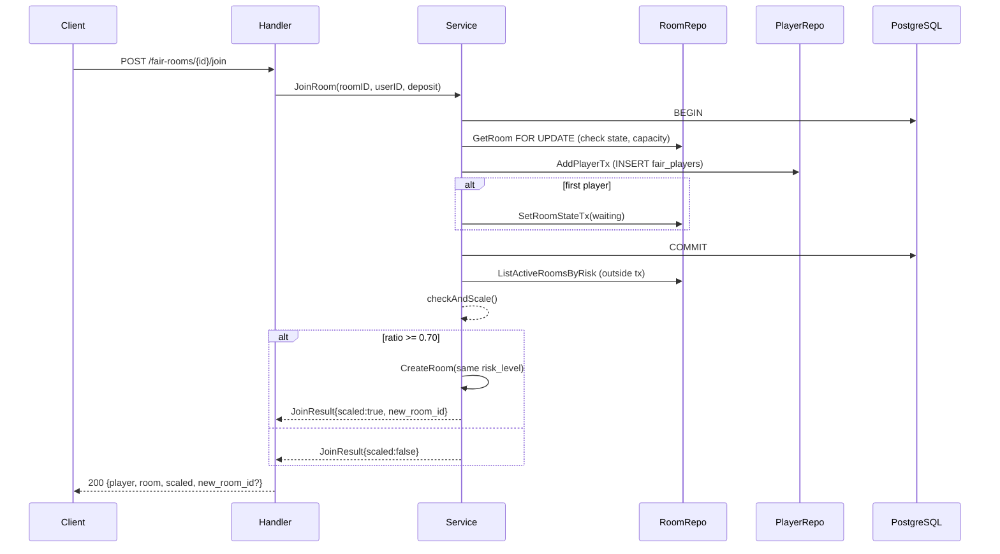
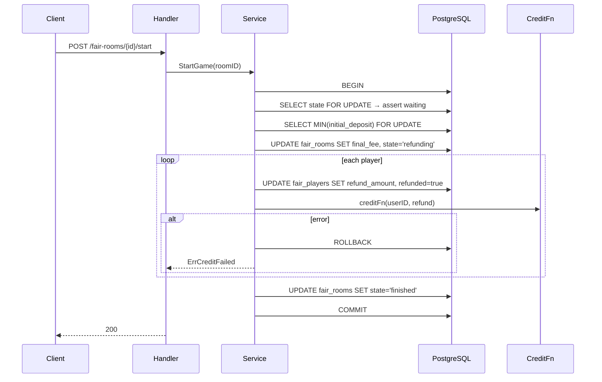

# Design Document — Provably Fair Room Management System

## Overview

The Provably Fair Room Management System implements the algorithm described in `backend/algorithm.md`. It is built alongside the existing codebase using the same Go + Huma + Gin + pgx/v5 + PostgreSQL stack. The new system introduces UUID-based rooms with risk levels, a cryptographic seed fairness mechanism, deposit-based refund logic, and auto-scaling room supply.

The implementation follows the exact clean-architecture layer structure specified in the algorithm, with files placed under `backend/internal/` as described. It does **not** replace the existing room system — it is additive.

---

## Architecture

Exactly as specified in `algorithm.md` section 1:

```
HTTP Request
    │
    ▼
backend/internal/handler/room_handler.go
    │  Huma-typed Input/Output structs
    │  UUID validation, HTTP error mapping
    ▼
backend/internal/service/room_service.go
    │  Business logic: seed generation, auto-scale, refund
    │  Transaction management
    ▼
backend/internal/repository/
    │  room_repo.go   — Room CRUD, player_count aggregation
    │  player_repo.go — AddPlayer, MIN(deposit), refund updates
    ▼
PostgreSQL (pgx/v5 pool)
```

Additionally:
- `backend/internal/domain/` — shared types (RiskLevel, RoomState, FairRoom, FairPlayer, RoomView, JoinResult)
- `backend/db/migrations/000011_create_fair_rooms.sql` — DB schema

---

## Components and Interfaces

### 1. Domain types — `backend/internal/domain/fair_room.go`

```go
package domain

import (
    "time"
    "github.com/google/uuid"
)

type RiskLevel string

const (
    RiskLow    RiskLevel = "low"
    RiskMedium RiskLevel = "medium"
    RiskHigh   RiskLevel = "high"
)

// RiskLevelOrder defines the up-sell visibility: a player at level X sees rooms at X and above.
var RiskLevelOrder = map[RiskLevel][]RiskLevel{
    RiskLow:    {RiskLow, RiskMedium, RiskHigh},
    RiskMedium: {RiskMedium, RiskHigh},
    RiskHigh:   {RiskHigh},
}

type RoomState string

const (
    StateCreated   RoomState = "created"
    StateWaiting   RoomState = "waiting"
    StateRefunding RoomState = "refunding"
    StateFinished  RoomState = "finished"
)

// FairRoom is the core domain entity. SeedPhrase is tagged json:"-" and never serialised directly.
type FairRoom struct {
    ID          uuid.UUID `json:"id"`
    RiskLevel   RiskLevel `json:"risk_level"`
    State       RoomState `json:"state"`
    MaxCapacity int       `json:"max_capacity"`
    SeedPhrase  string    `json:"-"`           // NEVER in JSON output
    SeedHash    string    `json:"seed_hash"`
    FinalFee    float64   `json:"final_fee"`
    PlayerCount int       `json:"player_count"` // virtual, populated by repo via LEFT JOIN
    CreatedAt   time.Time `json:"created_at"`
    UpdatedAt   time.Time `json:"updated_at"`
}

// RoomView wraps FairRoom and adds SeedReveal, which is non-nil only when State == finished.
type RoomView struct {
    FairRoom
    SeedReveal *string `json:"seed_reveal,omitempty"`
}

type FairPlayer struct {
    ID             uuid.UUID `json:"id"`
    RoomID         uuid.UUID `json:"room_id"`
    UserID         uuid.UUID `json:"user_id"`
    InitialDeposit float64   `json:"initial_deposit"`
    RefundAmount   float64   `json:"refund_amount"`
    Refunded       bool      `json:"refunded"`
}

// JoinResult is returned by Service.JoinRoom.
type JoinResult struct {
    Player    FairPlayer `json:"player"`
    Room      FairRoom   `json:"room"`
    Scaled    bool       `json:"scaled"`
    NewRoomID *uuid.UUID `json:"new_room_id,omitempty"`
}
```

### 2. Repository — `backend/internal/repository/`

Two files, hand-written pgx/v5 (not sqlc-generated), to avoid touching the existing sqlc pipeline.

**`room_repo.go`** — Room CRUD and player_count aggregation:

```go
type RoomRepo struct{ pool *pgxpool.Pool }

// CreateRoom inserts a new room. ID and seed are generated in Go before insert.
func (r *RoomRepo) CreateRoom(ctx context.Context, room domain.FairRoom) (domain.FairRoom, error)

// GetRoom fetches a room by UUID, computing player_count via LEFT JOIN COUNT.
func (r *RoomRepo) GetRoom(ctx context.Context, id uuid.UUID) (domain.FairRoom, error)

// ListAvailableRooms returns rooms with state in (created, waiting), player_count < max_capacity,
// and risk_level in the provided list (used for up-sell).
func (r *RoomRepo) ListAvailableRooms(ctx context.Context, levels []domain.RiskLevel) ([]domain.FairRoom, error)

// ListActiveRoomsByRisk returns all rooms with state in (created, waiting) for a given risk_level.
// Used by checkAndScale.
func (r *RoomRepo) ListActiveRoomsByRisk(ctx context.Context, level domain.RiskLevel) ([]domain.FairRoom, error)

// SetRoomStateTx updates room state within an existing transaction.
func (r *RoomRepo) SetRoomStateTx(ctx context.Context, tx pgx.Tx, id uuid.UUID, state domain.RoomState) error

// SetRoomFinalFeeTx sets final_fee and transitions state to refunding within a transaction.
func (r *RoomRepo) SetRoomFinalFeeTx(ctx context.Context, tx pgx.Tx, id uuid.UUID, finalFee float64) error
```

**`player_repo.go`** — Player operations:

```go
type PlayerRepo struct{ pool *pgxpool.Pool }

// AddPlayerTx inserts a player within an existing transaction.
// Uses SELECT ... FOR UPDATE on the room row to prevent race conditions.
func (r *PlayerRepo) AddPlayerTx(ctx context.Context, tx pgx.Tx, player domain.FairPlayer) error

// GetMinDepositTx returns MIN(initial_deposit) for a room, using FOR UPDATE to lock rows.
func (r *PlayerRepo) GetMinDepositTx(ctx context.Context, tx pgx.Tx, roomID uuid.UUID) (float64, error)

// ListPlayersTx returns all players for a room within a transaction.
func (r *PlayerRepo) ListPlayersTx(ctx context.Context, tx pgx.Tx, roomID uuid.UUID) ([]domain.FairPlayer, error)

// UpdateRefundTx sets refund_amount and refunded=true for a player within a transaction.
func (r *PlayerRepo) UpdateRefundTx(ctx context.Context, tx pgx.Tx, playerID uuid.UUID, refundAmount float64) error
```

### 3. Service — `backend/internal/service/room_service.go`

```go
type RoomService struct {
    pool       *pgxpool.Pool
    roomRepo   *repository.RoomRepo
    playerRepo *repository.PlayerRepo
}

// CreateRoom generates seed_phrase = hex(crypto/rand 32 bytes), seed_hash = hex(SHA-256(seed_phrase)),
// assigns a uuid.New() ID, and persists the room.
func (s *RoomService) CreateRoom(ctx context.Context, riskLevel domain.RiskLevel) (*domain.RoomView, error)

// GetRoom fetches the room and populates SeedReveal only if state == finished.
func (s *RoomService) GetRoom(ctx context.Context, id uuid.UUID) (*domain.RoomView, error)

// ListRooms resolves the up-sell levels via domain.RiskLevelOrder and delegates to repo.
func (s *RoomService) ListRooms(ctx context.Context, riskLevel domain.RiskLevel) ([]domain.RoomView, error)

// JoinRoom runs the join transaction, then calls checkAndScale outside the transaction.
func (s *RoomService) JoinRoom(ctx context.Context, roomID, userID uuid.UUID, deposit float64) (*domain.JoinResult, error)

// StartGame runs the full refund algorithm atomically (algorithm.md section 7).
// creditFn is the injected external balance credit function.
func (s *RoomService) StartGame(ctx context.Context, roomID uuid.UUID) error
```

**Seed generation** (exact algorithm from section 3.2):
```go
buf := make([]byte, 32)
_, _ = rand.Read(buf)                          // crypto/rand
seedPhrase := hex.EncodeToString(buf)
hash := sha256.Sum256([]byte(seedPhrase))
seedHash := hex.EncodeToString(hash[:])
```

**checkAndScale** (algorithm section 5):
```go
func (s *RoomService) checkAndScale(ctx context.Context, level domain.RiskLevel) (*uuid.UUID, error) {
    rooms, _ := s.roomRepo.ListActiveRoomsByRisk(ctx, level)
    if len(rooms) == 0 { return nil, nil }
    atThreshold := 0
    for _, r := range rooms {
        if float64(r.PlayerCount)/float64(r.MaxCapacity) >= 0.70 {
            atThreshold++
        }
    }
    ratio := float64(atThreshold) / float64(len(rooms))
    if ratio >= 0.70 {
        newRoom, err := s.CreateRoom(ctx, level)
        if err != nil { return nil, err }
        return &newRoom.ID, nil
    }
    return nil, nil
}
```

**creditUserBalance** — injected as a function field on the service:
```go
type CreditFn func(ctx context.Context, userID uuid.UUID, amount float64) error
```
For the initial implementation, this is a no-op stub. The field is exported so it can be replaced with a real implementation later.

### 4. Handler — `backend/internal/handler/room_handler.go`

Huma-typed handler. Delegates entirely to `RoomService`. Responsibilities:
- Parse and validate UUID path params with `uuid.Parse()` → HTTP 400 "invalid room id" on failure
- Map typed service errors to HTTP codes (see Error Handling section)
- Never expose `SeedPhrase` — only `RoomView.SeedReveal`

**Registered routes** (added to `services/api/main.go`):

| Method | Path | Handler method |
|--------|------|----------------|
| POST | `/fair-rooms` | `Create` |
| GET | `/fair-rooms` | `List` |
| GET | `/fair-rooms/{id}` | `Get` |
| POST | `/fair-rooms/{id}/join` | `Join` |
| POST | `/fair-rooms/{id}/start` | `Start` |

> Note: Routes use `/fair-rooms` prefix to avoid collision with the existing `/rooms` routes.

---

## Data Models

### DB Migration — `backend/db/migrations/000011_create_fair_rooms.sql`

```sql
CREATE TYPE fair_risk_level AS ENUM ('low', 'medium', 'high');
CREATE TYPE fair_room_state  AS ENUM ('created', 'waiting', 'refunding', 'finished');

CREATE TABLE fair_rooms (
    id           UUID        PRIMARY KEY DEFAULT gen_random_uuid(),
    risk_level   fair_risk_level NOT NULL,
    state        fair_room_state NOT NULL DEFAULT 'created',
    max_capacity INT         NOT NULL DEFAULT 10,
    seed_phrase  TEXT        NOT NULL,
    seed_hash    TEXT        NOT NULL,
    final_fee    NUMERIC(18,8) NOT NULL DEFAULT 0,
    created_at   TIMESTAMPTZ NOT NULL DEFAULT NOW(),
    updated_at   TIMESTAMPTZ NOT NULL DEFAULT NOW()
);

CREATE TABLE fair_players (
    id              UUID          PRIMARY KEY DEFAULT gen_random_uuid(),
    room_id         UUID          NOT NULL REFERENCES fair_rooms(id) ON DELETE CASCADE,
    user_id         UUID          NOT NULL,
    initial_deposit NUMERIC(18,8) NOT NULL,
    refund_amount   NUMERIC(18,8) NOT NULL DEFAULT 0,
    refunded        BOOLEAN       NOT NULL DEFAULT FALSE,
    UNIQUE(room_id, user_id)
);

CREATE INDEX idx_fair_rooms_risk_state ON fair_rooms(risk_level, state);
CREATE INDEX idx_fair_players_room     ON fair_players(room_id);
```

`player_count` is computed via `LEFT JOIN COUNT(*)` in every room query — not stored.

---

## Error Handling

Typed sentinel errors in the service layer, mapped to HTTP codes in the handler:

| Sentinel error | HTTP Code | Response message |
|---|---|---|
| `ErrInvalidUUID` | 400 | "invalid room id" |
| `ErrRoomFull` | 400 | "room is full" |
| `ErrNotAccepting` | 400 | "room is not accepting players" |
| `ErrNotWaiting` | 400 | "room must be in waiting state to start" |
| `ErrDuplicatePlayer` (pgx UNIQUE 23505) | 409 | "user already in this room" |
| `ErrCreditFailed` (rollback triggered) | 500 | "refund transaction failed" |
| `pgx.ErrNoRows` | 404 | "room not found" |

---

## Refund Transaction (algorithm.md section 7)

Executed atomically in `StartGame`:

```
1. BEGIN TRANSACTION
2. SELECT state FROM fair_rooms WHERE id = $1 FOR UPDATE  → verify == 'waiting'
3. SELECT MIN(initial_deposit) FROM fair_players WHERE room_id = $1 FOR UPDATE
4. UPDATE fair_rooms SET final_fee = $min, state = 'refunding', updated_at = NOW()
5. For each player:
     refund = MAX(0, initial_deposit − final_fee)
     UPDATE fair_players SET refund_amount = refund, refunded = TRUE
     creditFn(userID, refund)   ← if error → ROLLBACK
6. UPDATE fair_rooms SET state = 'finished', updated_at = NOW()
7. COMMIT
```

---

## Testing Strategy

The algorithm defines 20 test cases (TC-01 through TC-20). They map to:

- **Unit tests** (`backend/tests/fair_rooms/unit_test.go`):
  - Seed generation and SHA-256 verification (TC-01, TC-03, TC-19)
  - Refund calculation logic (TC-04, TC-05, TC-06)
  - Auto-scale ratio computation (TC-07, TC-08, TC-09)
  - Up-sell level filtering via `RiskLevelOrder` (TC-10, TC-11)

- **Integration tests** (`backend/tests/fair_rooms/integration_test.go`, real DB):
  - State transitions (TC-02, TC-14, TC-18)
  - Error cases (TC-12, TC-13, TC-15, TC-16)
  - Refund atomicity with injected failing creditFn (TC-17)
  - Concurrency / race condition (TC-20)

---

## Sequence Diagrams

### JoinRoom with Auto-Scale



### StartGame (Refund)


