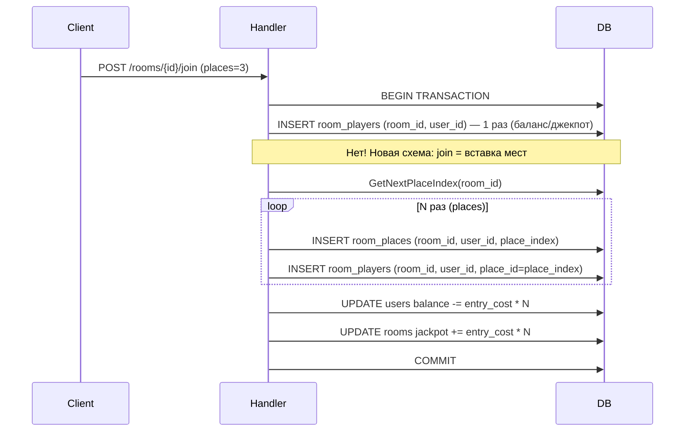

# Design Document: room_players Refactor

## Overview

Цель рефакторинга — изменить семантику таблицы `room_players`: вместо одной записи на игрока (с полем `places` или без него) каждая запись теперь соответствует **одному месту**. Таблица `room_places` становится первичной — место сначала создаётся там, а `room_players` ссылается на него через `place_id` (FK на `room_places(room_id, place_index)`).

Составной PK `room_players` меняется с `(room_id, user_id)` на `(room_id, user_id, place_id)`.

## Architecture

### Текущая схема (до рефакторинга)

```
room_players
  room_id   INTEGER  FK → rooms
  user_id   INTEGER  FK → users
  joined_at TIMESTAMPTZ
  PK: (room_id, user_id)

room_places
  room_id     INTEGER  FK → rooms
  user_id     INTEGER  FK → users
  place_index INTEGER
  created_at  TIMESTAMPTZ
  PK: (room_id, place_index)
```

Проблема: `room_players` и `room_places` — параллельные таблицы без прямой связи между собой. Количество мест вычисляется через JOIN/COUNT.

### Целевая схема (после рефакторинга)

```
room_places
  room_id     INTEGER  FK → rooms(room_id) ON DELETE CASCADE
  user_id     INTEGER  FK → users(id) ON DELETE CASCADE
  place_index INTEGER
  created_at  TIMESTAMPTZ
  PK: (room_id, place_index)

room_players
  room_id   INTEGER  FK → rooms(room_id) ON DELETE CASCADE
  user_id   INTEGER  FK → users(id) ON DELETE CASCADE
  place_id  INTEGER  FK → room_places(room_id, place_index) ON DELETE CASCADE
  joined_at TIMESTAMPTZ
  PK: (room_id, user_id, place_id)
```

Теперь каждая запись `room_players` — это одно место. Если игрок занял 3 места, в `room_players` будет 3 строки с одинаковым `(room_id, user_id)` но разными `place_id`.

### Поток операций



**Важное решение по балансу**: при новой схеме `entry_cost` списывается **за каждое место** (N раз). Это меняет логику `JoinRoom` — текущий SQL-запрос списывает баланс один раз. Нужно либо:
- Оставить списание один раз (entry_cost × N в одной операции), либо
- Вставлять N записей в `room_players` и списывать N × entry_cost.

Выбираем вариант: **N записей в `room_players`, баланс списывается один раз суммой N × entry_cost** через транзакцию в хендлере (не через атомарный SQL CTE, т.к. CTE не поддерживает цикл).

## Components and Interfaces

### 1. Миграция БД (`000015_refactor_room_players.sql`)

**Up:**
- Удалить существующий PK `(room_id, user_id)` из `room_players`
- Добавить колонку `place_id INTEGER NOT NULL` (с временным DEFAULT для существующих данных)
- Добавить FK: `FOREIGN KEY (room_id, place_id) REFERENCES room_places(room_id, place_index) ON DELETE CASCADE`
- Добавить новый PK: `(room_id, user_id, place_id)`
- Мигрировать существующие данные: для каждой записи в `room_players` найти соответствующую запись в `room_places` и проставить `place_id`
- Убрать временный DEFAULT

**Down:**
- Удалить FK и новый PK
- Удалить колонку `place_id`
- Восстановить PK `(room_id, user_id)`

### 2. SQL-запросы (`backend/db/queries/rooms.sql`)

Изменяемые запросы:

| Запрос | Изменение |
|--------|-----------|
| `JoinRoom` | Убрать из CTE — логика переносится в хендлер (транзакция) |
| `JoinRoomAndUpdateStatus` | Аналогично — только обновляет статус/джекпот/баланс, без вставки в `room_players` |
| `BotJoinRoom` | Аналогично |
| `InsertRoomPlayer` | Новый запрос: `INSERT INTO room_players (room_id, user_id, place_id, joined_at)` |
| `LeaveRoom` / `LeaveRoomAndUpdateStatus` | Удаление по `(room_id, user_id)` — каскад удалит все места |
| `ListRoomPlayers` | Теперь возвращает одну строку на место (или агрегирует по user_id — см. ниже) |
| `CountRoomPlayers` | Считает `COUNT(DISTINCT user_id)` для проверки вместимости |
| `GetPlayersWithStakes` | Упрощается: `COUNT(rp.place_id)` вместо JOIN с `room_places` |
| `GetRoundPlayers` | Упрощается аналогично |
| `GetRoundDetails` | Подзапрос `COUNT(*)` заменяется на `COUNT(rp.place_id)` |

**Решение по `ListRoomPlayers`**: возвращать агрегированные данные (одна строка на игрока с полем `places = COUNT(place_id)`), чтобы не ломать API-контракт с фронтендом.

### 3. Go-модели (`backend/repository/models.go`)

```go
// Обновлённая структура
type RoomPlayer struct {
    RoomID   int32     `json:"room_id"`
    UserID   int32     `json:"user_id"`
    PlaceID  int32     `json:"place_id"`   // новое поле
    JoinedAt time.Time `json:"joined_at"`
}
```

### 4. Хендлер `JoinRoom` (`backend/handlers/room_handler.go`)

Текущая логика:
1. Проверки (статус, вместимость, баланс)
2. `JoinRoomAndUpdateStatus` (CTE: вставка в `room_players` + баланс + джекпот)
3. `GetNextPlaceIndex` + N × `InsertRoomPlace`

Новая логика:
1. Проверки (статус, вместимость, баланс × N)
2. BEGIN TRANSACTION
3. `GetNextPlaceIndex`
4. Цикл N раз:
   - `InsertRoomPlace` → получаем `place_index`
   - `InsertRoomPlayer(room_id, user_id, place_id=place_index)`
5. `UpdateUserBalance(user_id, -entry_cost * N)`
6. `UpdateRoomJackpot(room_id, +entry_cost * N)`
7. `UpdateRoomStatus` (если нужно)
8. COMMIT

Альтернатива: оставить `JoinRoomAndUpdateStatus` для обновления баланса/джекпота/статуса, добавить отдельный `InsertRoomPlayer` для вставки в `room_players`.

**Выбираем альтернативу** — минимальные изменения в хендлере:
- `JoinRoomAndUpdateStatus` убирает вставку в `room_players` из CTE, только обновляет баланс/джекпот/статус
- Хендлер вставляет места и записи `room_players` в цикле

### 5. Крон `RoomStarter` (`backend/internal/crons/room_starter.go`)

Текущая логика для ботов:
1. `BotJoinRoom` (вставляет в `room_players`)
2. `GetNextPlaceIndex` + `InsertRoomPlace`

Новая логика:
1. `BotJoinRoom` убирает вставку в `room_players` из CTE
2. `GetNextPlaceIndex` → `InsertRoomPlace` → `InsertRoomPlayer`

### 6. Новый SQL-запрос `InsertRoomPlayer`

```sql
-- name: InsertRoomPlayer :one
INSERT INTO room_players (room_id, user_id, place_id, joined_at)
VALUES ($1, $2, $3, CURRENT_TIMESTAMP)
RETURNING *;
```

## Data Models

### Схема после миграции

```sql
CREATE TABLE room_players (
    room_id   INTEGER NOT NULL REFERENCES rooms(room_id) ON DELETE CASCADE,
    user_id   INTEGER NOT NULL REFERENCES users(id) ON DELETE CASCADE,
    place_id  INTEGER NOT NULL,
    joined_at TIMESTAMPTZ NOT NULL DEFAULT CURRENT_TIMESTAMP,
    PRIMARY KEY (room_id, user_id, place_id),
    FOREIGN KEY (room_id, place_id) REFERENCES room_places(room_id, place_index) ON DELETE CASCADE
);
```

### Инварианты данных

- Для каждой записи `room_players(room_id, user_id, place_id)` должна существовать запись `room_places(room_id, place_index=place_id)` с тем же `user_id`.
- `COUNT(DISTINCT user_id) WHERE room_id = X` = количество уникальных игроков в комнате.
- `COUNT(*) WHERE room_id = X AND user_id = Y` = количество мест игрока Y в комнате X.

## Error Handling

- Если `InsertRoomPlace` успешен, но `InsertRoomPlayer` падает — транзакция откатывается, данные консистентны.
- Если FK нарушен (place_id не существует в room_places) — БД вернёт ошибку 23503, хендлер вернёт 500.
- Каскадное удаление: при удалении записи из `room_places` автоматически удаляется соответствующая запись из `room_players`.

## Testing Strategy

- Обновить `backend/tests/room_places/main.go`: проверить, что после `JoinRoom` с N местами в `room_players` N записей.
- Проверить каскадное удаление: `LeaveRoom` → 0 записей в `room_players` и `room_places`.
- Проверить `GetPlayersWithStakes`: ставки считаются корректно через `COUNT(rp.place_id)`.
- Проверить `CountRoomPlayers` (distinct users) для логики вместимости.
